<a href="https://juandi9585.github.io/jdflores-dev/">
  <picture>
    <source media="(prefers-color-scheme: dark)" srcset="assets/hero-dark.svg">
    <source media="(prefers-color-scheme: light)" srcset="assets/hero-light.svg">
    
  </picture>
</a>

  <a href="https://juandi9585.github.io/jdflores-dev/"><picture><source media="(prefers-color-scheme: dark)" srcset="assets/btn-portfolio-dark.svg"><source media="(prefers-color-scheme: light)" srcset="assets/btn-portfolio-light.svg"></picture></a>
  <a href="https://juandi9585.github.io/jdflores-dev/Juan-Diego-Flores-CV-EN.pdf"><picture><source media="(prefers-color-scheme: dark)" srcset="assets/btn-resume-en-dark.svg"><source media="(prefers-color-scheme: light)" srcset="assets/btn-resume-en-light.svg"></picture></a>
  <a href="https://juandi9585.github.io/jdflores-dev/Juan-Diego-Flores-CV-ES.pdf"><picture><source media="(prefers-color-scheme: dark)" srcset="assets/btn-resume-es-dark.svg"><source media="(prefers-color-scheme: light)" srcset="assets/btn-resume-es-light.svg"></picture></a>
  <a href="https://www.linkedin.com/in/juan-diego-flores-686334268/"><picture><source media="(prefers-color-scheme: dark)" srcset="assets/btn-linkedin-dark.svg"><source media="(prefers-color-scheme: light)" srcset="assets/btn-linkedin-light.svg"></picture></a>
  <a href="mailto:juandi9585@gmail.com"><picture><source media="(prefers-color-scheme: dark)" srcset="assets/btn-email-dark.svg"><source media="(prefers-color-scheme: light)" srcset="assets/btn-email-light.svg"></picture></a>

I'm a Systems Engineer who ships AI agents and full-stack systems into production at banks. Today I work freelance as an AI Developer contracted to Banesco, Banco Universal, and I own the whole build: front end, back end, and the agent orchestration on Google Cloud and n8n. I work AI-first, mostly with Claude Code: agents draft, I direct and verify, with the release discipline of a core banking system.

Hablo español: escríbeme en el idioma que prefieras.

<picture>
  <source media="(prefers-color-scheme: dark)" srcset="assets/impact-dark.svg">
  <source media="(prefers-color-scheme: light)" srcset="assets/impact-light.svg">
  
</picture>

Most of that work is under client confidentiality, so its code is private. This is what you can open:

<a href="https://github.com/juandi9585/jdflores-dev">
  <picture>
    <source media="(prefers-color-scheme: dark)" srcset="assets/project-portfolio-dark.svg">
    <source media="(prefers-color-scheme: light)" srcset="assets/project-portfolio-light.svg">
    
  </picture>
</a>
<a href="https://github.com/juandi9585/juego-banderas"><picture><source media="(prefers-color-scheme: dark)" srcset="assets/project-banderas-dark.svg"><source media="(prefers-color-scheme: light)" srcset="assets/project-banderas-light.svg"></picture></a>
<a href="https://github.com/juandi9585/aero-store-quarkus"><picture><source media="(prefers-color-scheme: dark)" srcset="assets/project-aerostore-dark.svg"><source media="(prefers-color-scheme: light)" srcset="assets/project-aerostore-light.svg"></picture></a>

<picture>
  <source media="(prefers-color-scheme: dark)" srcset="assets/stack-dark.svg">
  <source media="(prefers-color-scheme: light)" srcset="assets/stack-light.svg">
  
</picture>

<picture>
  <source media="(prefers-color-scheme: dark)" srcset="assets/trajectory-dark.svg">
  <source media="(prefers-color-scheme: light)" srcset="assets/trajectory-light.svg">
  
</picture>

<picture>
  <source media="(prefers-color-scheme: dark)" srcset="assets/credentials-dark.svg">
  <source media="(prefers-color-scheme: light)" srcset="assets/credentials-light.svg">
  
</picture>

<picture>
  <source media="(prefers-color-scheme: dark)" srcset="https://raw.githubusercontent.com/juandi9585/juandi9585/output/snake-dark.svg">
  <source media="(prefers-color-scheme: light)" srcset="https://raw.githubusercontent.com/juandi9585/juandi9585/output/snake-light.svg">
  
</picture>

<a href="mailto:juandi9585@gmail.com">
  <picture>
    <source media="(prefers-color-scheme: dark)" srcset="assets/footer-dark.svg">
    <source media="(prefers-color-scheme: light)" srcset="assets/footer-light.svg">
    
  </picture>
</a>
